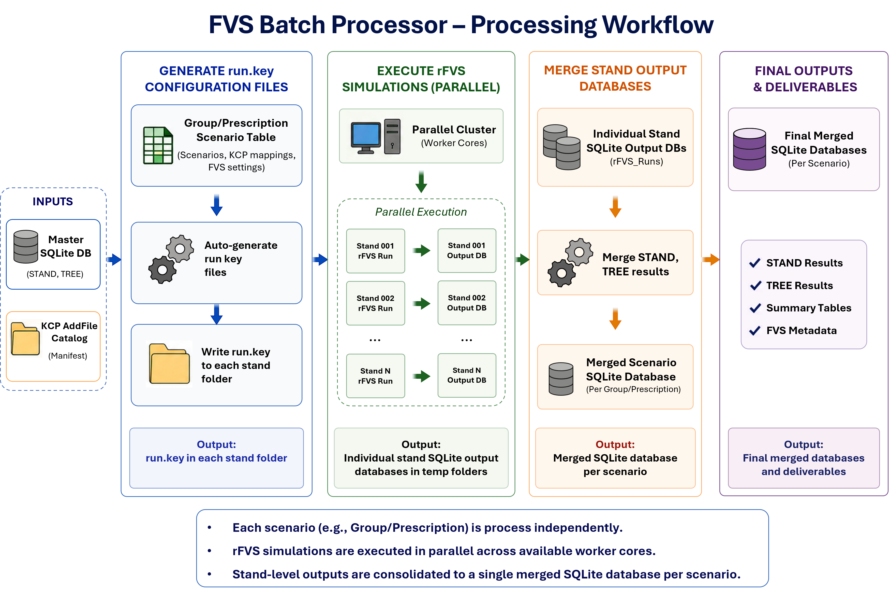

# FVSBatchProcessor

`FVSBatchProcessor` packages the FVS batch-processing Shiny app for GitHub installation.



## Install

```r
install.packages("remotes")
remotes::install_github("https://github.com/codydangerfield-usfs/FVSBatchProcessor")
```

`rFVS` is a required dependency and is declared in `Remotes`, so it will be installed automatically from USDA Forest Service when installing this package from GitHub.

## Run

```r
library(FVSBatchProcessor)
fvsRunBatch()
```

## Project Layout

- `R/app_globals_utils.R`: global defaults and utility helpers
- `R/app_ui.R`: Shiny UI definition
- `R/app_server.R`: server logic
- `R/fvsRunBatch.R`: exported app launcher
- `inst/www/`: packaged static assets
