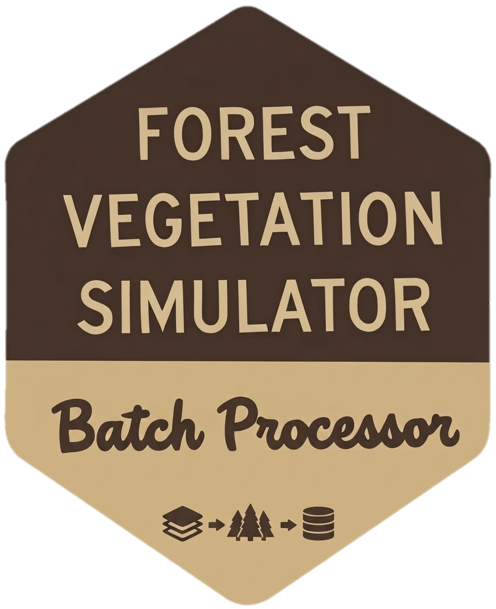

# FVSBatchProcessor

`FVSBatchProcessor` is a Shiny application for configuring and running large Forest Vegetation Simulator (FVS) projects. It connects an FVS-ready SQLite inventory database with keyword component files (KCPs), generates stand- and scenario-specific keyfiles, runs simulations in parallel through `rFVS`, and consolidates the resulting stand databases into scenario-level and project-level outputs.




### Install

```r
install.packages("remotes")
remotes::install_github("https://github.com/codydangerfield-usfs/FVSBatchProcessor")
```

`rFVS` is a required dependency and is declared in `Remotes`, so it will be installed automatically from USDA Forest Service when installing this package from GitHub.

<br clear="right">

## Run

```r
library(FVSBatchProcessor)
setwd(<FVS_Project_Folder>)
fvsRunBatch()
```

## Project Layout

- `R/app_globals_utils.R`: global defaults and utility helpers
- `R/app_ui.R`: Shiny UI definition
- `R/app_server.R`: server logic
- `R/fvsRunBatch.R`: exported app launcher
- `inst/www/`: packaged static assets

